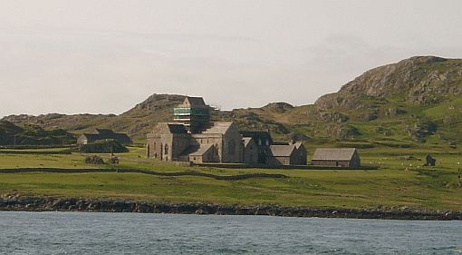
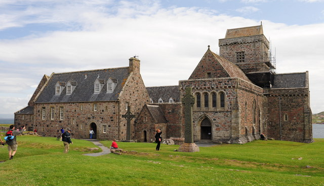

# The Viking Invasions

### Vikings First Contact with England

* England prospers economically and culturally in the 8th Century; particularly by the 790s
* Northumbria (northern England / southern Scotland) has cultural boom sometimes called "The Northumbrian Renaissance"
* Monasteries at Jarrow, Lindisfarne, and Iona major beneficiaries of cultural boon
* Vikings first land at Isle of Portland in southern Wessex (southwestern England) in 792
* Port authorities likely thought Vikings were traders at first; Vikings sent volley of arrows killing them instantly
* News of 1st Viking attack spread quickly and monasteries of Kent constructed coastal defenses

